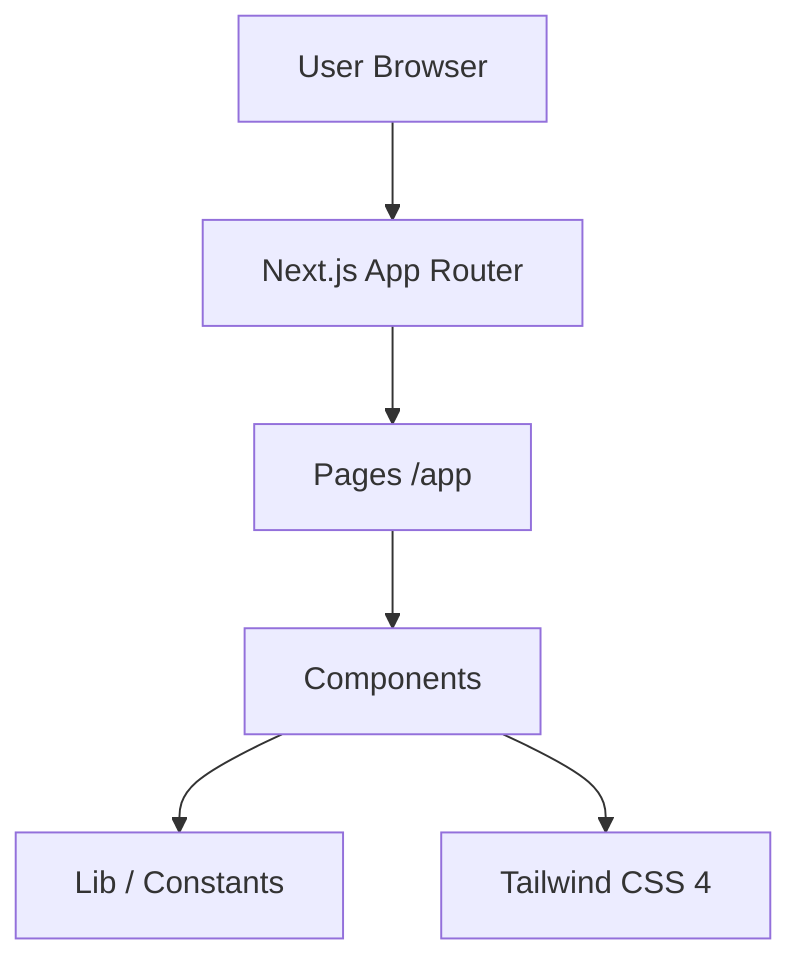

# Olivetto Contabilidade

Site institucional da Oliveto Contabilidade, especializado em Perícia Contábil, Auditoria e Consultoria.

## Tech Stack

- **Framework**: Next.js 16 (App Router)
- **Language**: TypeScript
- **Styling**: Tailwind CSS 4
- **UI Components**: Radix UI (Primitivos)
- **Icons**: Lucide React
- **Animations**: Tailwind CSS Animate

## Prerequisites

- Node.js 18+
- pnpm (v9+)

## Environment Setup

Refer to `.env.example` if available. Currently, the project uses local constants.

## Installation & Running

```bash
# Install dependencies
pnpm install

# Run development server
pnpm dev

# Build for production
pnpm build
```

## Testing

```bash
# Run linting
pnpm lint
```

## Architecture



## Project Structure

- `app/`: Next.js pages and layouts (App Router).
- `components/`: UI components organized by feature.
- `lib/`: Utilities, hooks, and static constants (including `heroContent`).
- `public/`: Static assets like images and icons.
- `docs/`: Technical documentation and business flows.

## Links

- [Documentation](./docs)
- [Changelog](./CHANGELOG.md)
