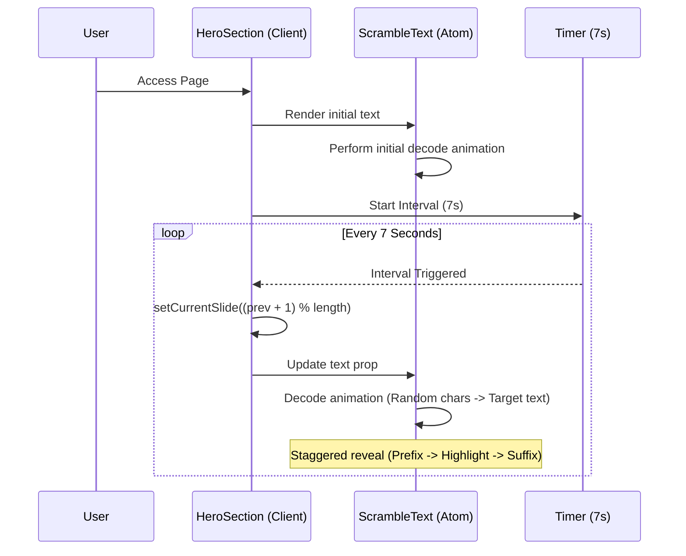

# Hero Section Alternating Phrases Flow

## Context

The Hero Section displays key marketing messages to the user. To increase engagement and convey more information without cluttering the screen, we use an alternating phrase system with a "matrix" decode animation.

## Pre-conditions

- `heroContent` constant must contain a `slides` array in `lib/constants/hero.ts`.

## Sequence Diagram

## Edge Cases

- **Single Slide**: If the `slides` array has only one item, it animates once on load and stays.
- **Tab Inactivity**: Modern browsers might throttle the interval when the tab is inactive. The animation resumes smoothly when the user returns.

## Data Dictionary

- `prefix`: Text appearing before the highlighted word.
- `highlight`: The key phrase styled with the brand's primary color (`var(--primary)`).
- `suffix`: Text appearing after the highlighted word, usually on a new line.
